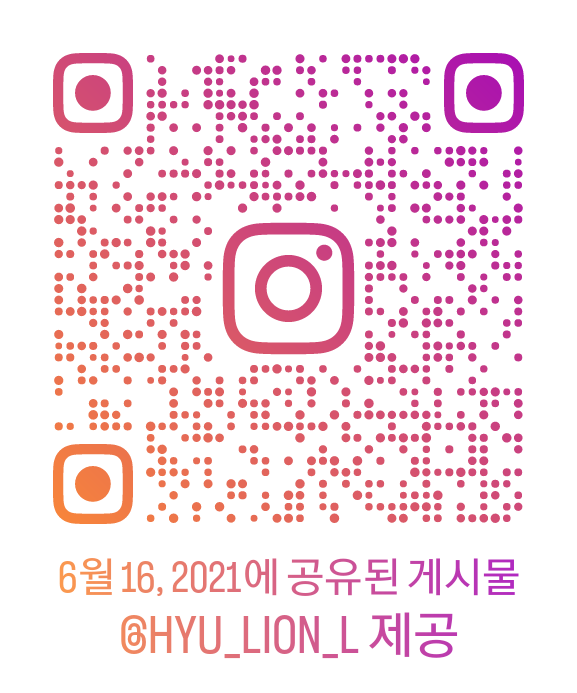

ˀ̣ˀ̣و✧&20render&fontsize=30)

# Gahyun LIM
임가현
___

## 📚 Education 
>__Majored in__ Physical Education ( 2019. 03 - 2024. 02 )
>>__Minored in__ Computer Software Engineering

> __SSAFY__ (Samsung Software Academy for Youth, 2024. 01 - )
___

## 🧍‍♂️ Personality
- INTP
___

## 🖥️ 인상깊었던 수업 / 개발자?! / 관심
- 버추얼피트니스이노베이션 (인공지능과 빅데이터를 이용한 VR운동프로그램을 통하여 체격, 자세, 체력분석을 통한 종합적인 체력수준 제공과 맞춤 운동 수행 결과 및 운동정보 자동 누적관리를 통한 예방, 치료, 재활 등의 프로그램의 계획과 실행 테크닉에 대해 학습한다.
AI, 모바일, 빅데이터 기반 헬스케어 전문교수진의 초융합, 초연결, 초지능 다면적 융합 솔루션을 통한 맞춤형 헬스케어 프로그램에 대해 학습하며 문제점을 도출하고 학생스스로 해법을 제시한다.^^) 
  - [마이베네핏](https://www.mybenefit.co.kr/)
  - [소개영상](https://www.youtube.com/watch?v=p3PvP6Cfc5M)

- 마이크로프로세서응용 - [LineTracer](https://www.youtube.com/shorts/ZjqrfY6Kgn0) 
---
- Digital Helath Care
___

## 👍 좋아요
- 영화 보기
- 따릉이
___

## ⚽ 취미
- 축구동아리 (MF)
- [클럽챔피언십](https://www.kusf.or.kr/club/club_post_view.html?seq=1074&page=8&e_code=3&p_code=2)
- 

___

## 🏠 ↔️ 🏢
- 성북구, 서울
- 1h 10m - 1h 30m
___

## 💡 싸피에서 가장 해보고 싶은 것
- 
___

## ❗ 1학기 다짐
-  SSAFY 1학기 무사 이수
___

## 📧 Email
